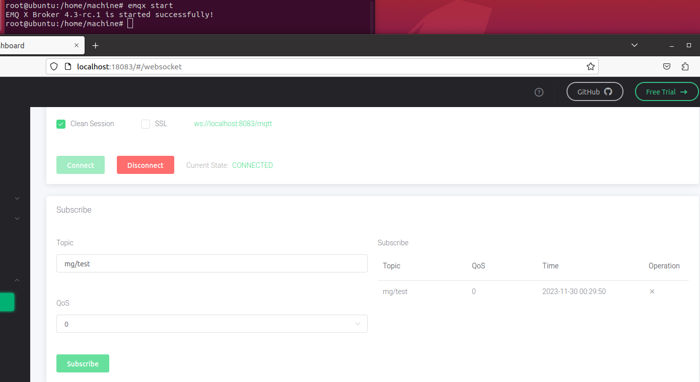
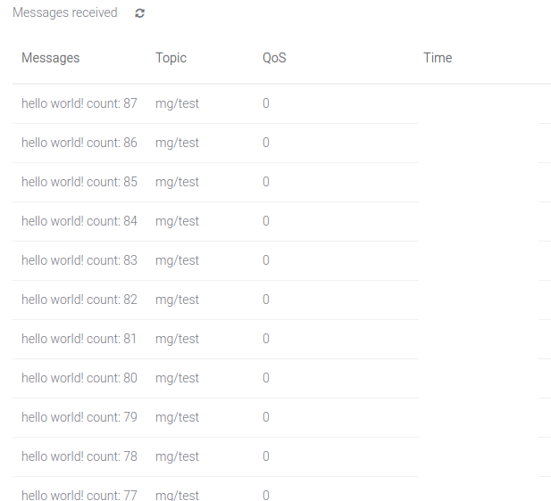

# mqtt-ws-client
simple use mongoose 

##### simple example to create a mqtt client
This example comes from: mongoose -> example -> mqtt-over-ws-client

- "mongoose" github repository. See [mongoose](https://github.com/cesanta/mongoose)
- Very easy to integrate: just copy `mongoose.c` and `mongoose.h` files to your source tree. See
  [exact steps](https://mongoose.ws/documentation/#2-minute-integration-guide)

### **SUBSCRIBE**
- topic

- message

